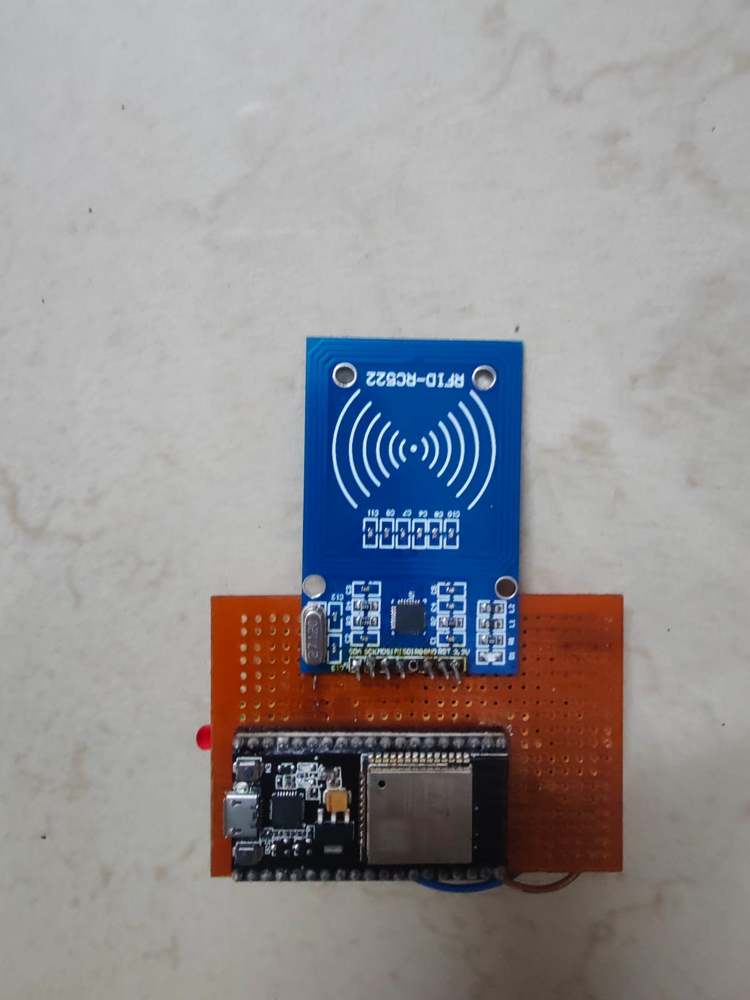
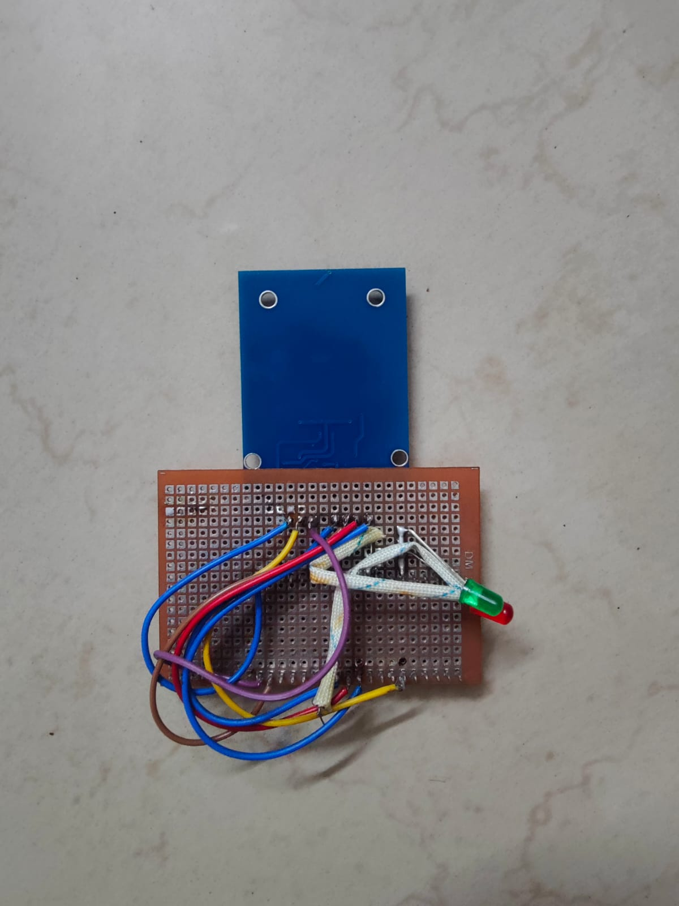
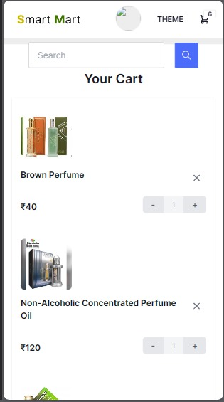

# Smart-Cart

The Smart-Cart project leverages RFID technology to enhance the shopping experience by automating product scanning and billing. This system is controlled by the ESP32 microcontroller, which communicates with a NestJS server and MongoDB database. Additionally, a Next.js web application allows users to view their cart details and make payments easily on both Android and iOS devices.

## Features

- **Automated Product Scanning**: Uses RFID technology to scan products with RFID tags when they are placed in the cart.
- **ESP32 Microcontroller**: Manages the RFID scanner and sends product data to the server.
- **Real-time Data Transmission**: Utilizes MQTT and HTTP protocols to transmit product data to the server for processing.
- **NestJS Server**: Handles backend processing, including calculating totals and generating bills.
- **MongoDB Database**: Stores product information and transaction data.
- **Next.js Web Application**: Provides a user-friendly interface for viewing cart details, order totals, and making payments.

## Technologies Used
- Hardware: `RFID tags`, `RFID scanner`, `ESP32 microcontroller`
- Backend: `NestJS`, `MongoDB`
- Frontend: `NextJS`
- Protocols: `MQTT`,`HTTP`

## Installation

To run the Smart-Cart project locally, follow these steps:

**Backend (NestJS Server)**

1. Clone the repository: `git clone https://github.com/defineSenTinaL/smart-cart`
2. Navigate to the server directory: `cd smart-cart/smart-cart-server`
3. Install dependencies: `npm install`
4. Start the development server: `npm run start:dev`
5. Open your browser and visit: `http://localhost:5000`
6. To build project for production: `npm run build`

**Frontend (Next.js Web Application)**

1. Clone the repository: `git clone https://github.com/defineSenTinaL/smart-cart`
2. Navigate to the server directory: `cd smart-cart/smart-cart-client`
3. Install dependencies: `npm install`
4. Start the development server: `npm run dev`
5. Open your browser and visit: `http://localhost:3000`
6. To build project for production: `npm run build`

## Usage

- **RFID Scanning**: Place a product with an RFID tag into the cart. The RFID scanner, controlled by the ESP32 microcontroller, will scan the tag.
- **Data Transmission**: The ESP32 sends product data to the server via MQTT and HTTP protocols.
- **Backend Processing**: The server receives the data, processes it, calculates the total, and generates a bill.
- **Web Application**: Users can log in to the web app to view their cart details, check the order total, and confirm the cart. They can proceed to make payments through the app.

## Future Enhancements

Here are some potential future enhancements for the Smart-Cart project:

- Implement user authentication and roles for enhanced security.
- Add real-time notifications for cart updates and payment   confirmations.
- Expand the system to include additional features such as inventory management and reporting.
- Integrate more payment gateways for better user convenience.

## Picture Gallery

Here are some screenshots showcasing the Simplified ERP System with React:

## License

This project is licensed under the [MIT License](LICENSE).
